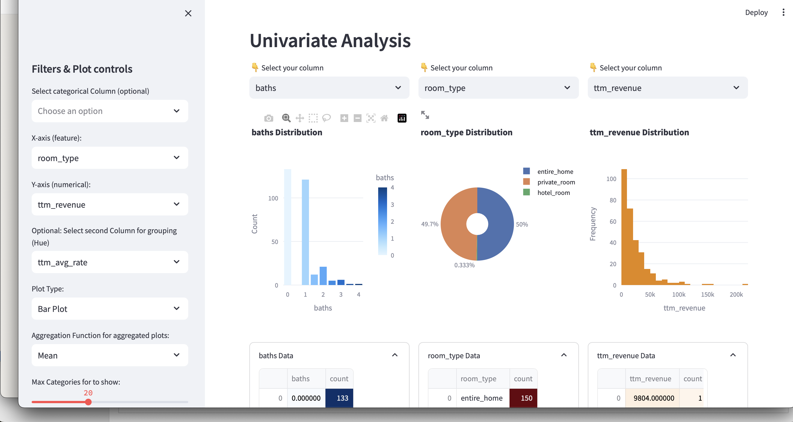

<div align="center">

# 🏡 **Airbnb Streamlit Dashboard – London Listings Analysis**

### 📊 *An interactive dashboard exploring Airbnb listings across London*


---
### ✨ *Turning raw Airbnb data into interactive insights*



</div>

---

An interactive **Streamlit dashboard** that explores **Airbnb listings in London**, revealing insights into pricing patterns, host performance, and property characteristics.  
This project demonstrates end-to-end data analysis — from cleaning and exploration in Jupyter to building a fully interactive dashboard.

---

## 🔍 Project Overview
This project aims to analyze Airbnb data for **London** and present key insights through an interactive dashboard.  
It highlights how property attributes (room type, host status, location, etc.) influence price and availability.

### 🎯 Objectives
- Clean and prepare raw Airbnb listing data  
- Perform exploratory data analysis (EDA) using Python  
- Build an interactive dashboard for visualization and user-driven exploration  

---

## 🧠 Tech Stack
| Tool | Purpose |
|------|----------|
| **Python** | Data manipulation & analysis |
| **Pandas, NumPy** | Data cleaning & transformation |
| **Matplotlib, Seaborn** | Exploratory visualizations |
| **Streamlit** | Interactive dashboard framework |
| **Jupyter Notebook** | Data preparation and exploration |

---
## 📂 Repository Structure
Airbnb-Streamlit-Dashboard/
│
- ├── data/                            # Cleaned dataset
- ├── images/                          # Visuals and exported plots
-    └── dashboard_preview.png        # Dashboard preview image
- ├── London-Airbnb.ipynb             # Jupyter notebook for EDA
- ├── dashboard.py                     # Streamlit dashboard code
- └── README.md                        # Project documentation

--- 

## 🧭 Dashboard Features
✅ Dynamic sidebar filters for exploring listings by:
- Room type  
- Superhost status  
- Number of guests allowed per listing and more  

✅ Visualize key relationships between variables such as:
- **Price vs Room Type**  
- **Availability vs Number of guests allowed**  
- **Superhost Performance Metrics**  

✅ Interactive charts that update in real-time based on user selection

---

## 🚀 How to Run the Project

1️⃣ **Clone the repository**
```bash
git clone https://github.com/OBEY97/Airbnb-Streamlit-Dashboard.git
cd Airbnb-Streamlit-Dashboard
pip install -r requirements.txt
streamlit run dashboard.py

```
---

## 📊 **Sample Insights**

💰 **Entire homes** command higher average prices than shared or private rooms.  

⭐ **Superhosts** consistently maintain better ratings and lower churn rates.  

📍 **Central London listings** show higher price variability than outer boroughs.  

---

## 🧑‍💻 **Author**

**Prince Banatu**  
_Data Analyst & Aspiring Data Scientist_  

📧 **Email:** mailto:princeobey97@outlook.com   
🌐 **LinkedIn:** https://www.linkedin.com/in/prince-banatu-b7904b300/  

---

## 📄 **License**

This project is licensed under the **MIT License** – see the [LICENSE](LICENSE) file for details.

---

## 🙏 **Acknowledgements**

- **Airbnb** for providing open-access listing data  
- The **Streamlit** community for tutorials and inspiration  
- **London Airbnb dataset contributors** for maintaining accessible datasets  

---

<div align="center">

> ✨ *“Where data meets design — transforming Airbnb listings into stories worth exploring.”*

</div>
